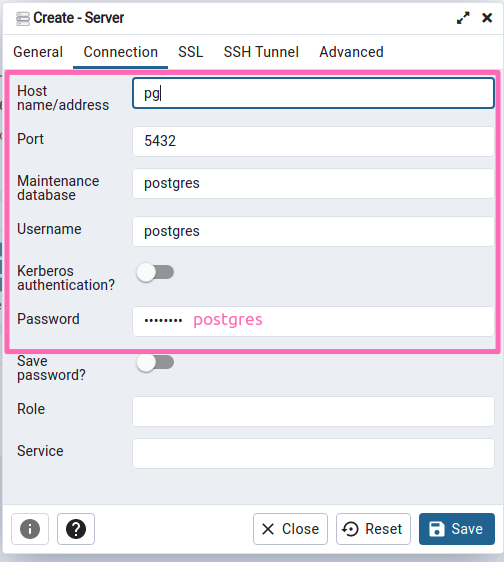

# Intelcia Group

The goal of this project is to model and implement a PostgreSQL database for a management platform that provides the ability to manage enterprise resources.

## Running Postgres locally

There's a docker-compose.yml file ready that will help you to define and run PostgreSQL! make sure you have docker & docker-compose installed on your machine and just use the command `docker-compose up` to make it run locally.

```sh
docker-compose up -d
```

## Configure PgAdmin 4

```
Email: intelcia@postgres.com
Password: postgres
```



- Launch pgAdmin 4 (http://localhost:8080)
- Go to the `Dashboard` tab. In the `Quick Link` section, click “Add New Server” to add a new connection.
- Select the `Connection` tab in the `Create-Server` window.
- Then, configure the connection as follows:
  - Enter server’s IP address as `pg` in the `Hostname/Address` field.
  - Specify the “Port” as `5432`.
  - Enter the name of the database in the “Database Maintenance” field.
  - Enter username as `postgres` & password as `postgres`
